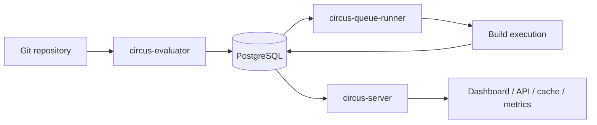
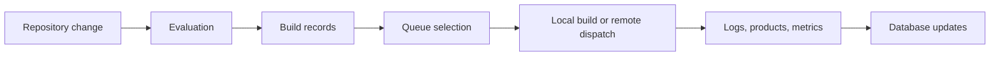
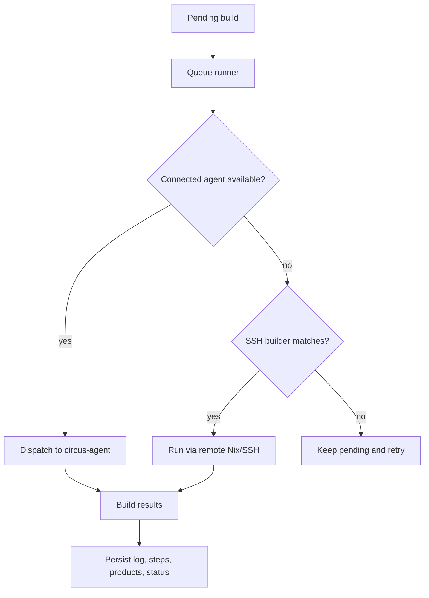
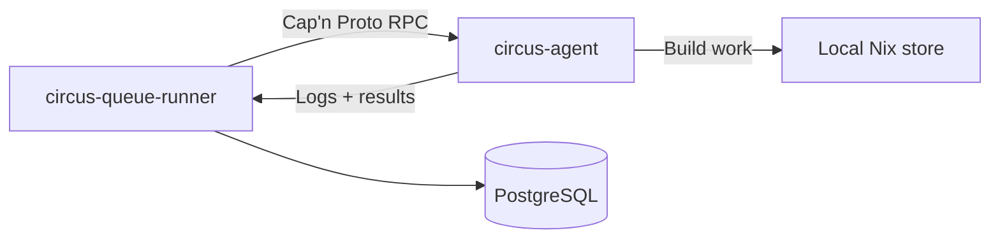

# Design

Circus is still pre-1.0, so this document describes the current shape of the
system rather than an aspirational future version. The goal is to explain how
the pieces fit together, what each daemon is responsible for, and where the
shared database sits in the picture. Until Circus reaches 1.0, this document may
be outdated at any given time but we'll try to keep it up to date as much as
humanly possible. Though, it's a rather difficult as you might appreciate so
your help through issues are appreciated :)

## Overview

Circus is a Nix-focused CI system built around a small set of long-running
services and a PostgreSQL database that acts as the source of truth.

The current deployment model is:

- **`circus-server`** for the API, dashboard, binary cache, metrics, webhooks,
  and authentication
- **`circus-evaluator`** for polling repositories and turning changes into
  evaluation records
- **`circus-queue-runner`** for selecting builds, dispatching work, and managing
  build execution
- **`circus-agent`** for optional persistent build hosts that receive work over
  a long-lived RPC connection
- **PostgreSQL** for all durable state

Most user-facing behavior flows through the server, but the build pipeline is
split on purpose. Evaluations and builds are distinct steps, and Circus keeps
that separation visible in the UI and in the database.

## The Main Pieces

### `circus-server`

The server is the public face of Circus. It serves the dashboard, exposes the
REST API, handles log and build browsing, publishes metrics, and answers cache
and webhook requests.

It also manages:

- API keys and user sessions
- dashboard login flows
- project, jobset, channel, build, and evaluation pages
- the binary cache endpoints
- authentication-backed admin operations

### `circus-evaluator`

The evaluator watches projects for changes and records new evaluations in the
database. It is the component that turns a repository update into something the
rest of Circus can act on.

In practice it:

- polls configured repositories
- reacts to database notifications when work changes
- evaluates Nix expressions
- records evaluation results and derived build data

### `circus-queue-runner`

The queue runner owns build execution. It pulls pending builds from the
database, chooses where they should run, and keeps the build lifecycle moving.

It currently supports two dispatch paths:

- **Legacy SSH builders**, where the runner shells out to remote Nix builds
- **Persistent agents**, where connected `circus-agent` processes receive work
  over Cap'n Proto RPC

The agent path is preferred when available. SSH builders remain as a fallback
and for mixed clusters.

### `circus-agent`

The agent is a long-running helper that sits on a build host. It connects back
to the queue runner, advertises the host's capabilities, receives assignments,
streams logs, and reports results.

This is the distributed-build path for clusters that want the runner to push
work to hosts without relying on per-build SSH setup.

### `circus-common`

`circus-common` holds the shared pieces used by the daemons:

- configuration loading
- database access helpers
- shared data models
- validation and bootstrap logic
- notification, logging, and maintenance helpers

### `circus-migrate` and `circus-migrations`

These crates manage database schema changes. `circus-migrate` is the CLI entry
point, and `circus-migrations` contains the SQL migration files and runtime
support.

## Data Flow

The build pipeline is deliberately split into stages so each step can be
observed independently.

The important part is that the database is not just a passive store. It is the
handoff point between the services. The evaluator records what should happen,
the queue runner decides what actually runs, and the server reads the result
back out for users.

### What gets stored where

- **PostgreSQL** stores projects, jobsets, evaluations, builds, users, API keys,
  notifications, and service state
- **The filesystem** stores logs, cache material, build working data, and other
  runtime artifacts
- **The Nix store** stores actual build outputs

## Build Execution

The queue runner is responsible for choosing the execution path for a build.
That choice depends on the configured systems, available builders, current load,
and whether persistent agents are connected.

The persistent agent path is used when the queue runner has an active connection
to a suitable host. When no agent is available, the runner can still use
configured SSH builders, which keeps existing clusters working while newer
agent-based deployments come online.

## Distributed Builds

Circus supports distributed builds in a way that stays practical for real
clusters.

The agent connection is long-lived. That gives the queue runner a live view of
which machines are available, what they can build, and how loaded they are. The
runner can then prefer a connected agent over an SSH builder when both would be
valid.

If the connection drops, the runner treats that agent as unavailable and retries
the build elsewhere on the next pass. That keeps the system resilient without
requiring manual cleanup for normal disconnects.

## Configuration

Circus is configured from a TOML file with environment variable overrides. The
same configuration tree is used across the daemons, but each daemon only reads
the sections it needs.

The current high-level groups are:

- `database`
- `server`
- `evaluator`
- `queue_runner`
- `gc`
- `logs`
- `notifications`
- `cache`
- `signing`
- `cache_upload`
- `oauth`
- `declarative`
- `nix`

Declarative startup data is also supported. On server startup, Circus can
bootstrap projects, jobsets, users, API keys, and remote builders from config.

## User-Facing Shape

From a user's point of view, Circus is organized around a few stable concepts:

- **Projects** group related repositories
- **Jobsets** describe what to evaluate and build
- **Evaluations** record a particular repository state
- **Builds** are the execution results users inspect
- **Channels** provide promoted outputs for consumers
- **Users and API keys** control access

This is why the dashboard mirrors those concepts directly. The service layout
exists to support that workflow, not to expose the internal daemon boundaries as
primary UI concepts.

## What Is Stable Today

The following parts of the design are already real in the current codebase:

- the three main daemons and the shared database model
- the optional persistent agent path
- the dashboard/API/cache/metrics server
- declarative bootstrap on startup
- authentication with API keys and user sessions
- the documented configuration tree

Areas that are still evolving are expected to change over time, especially the
distributed-build surface and the more advanced administrative workflows.
