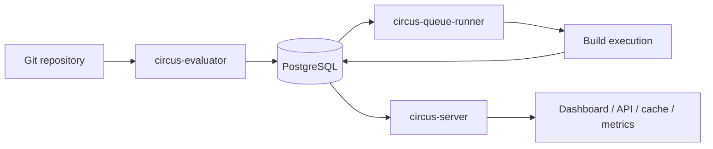
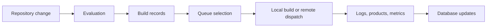
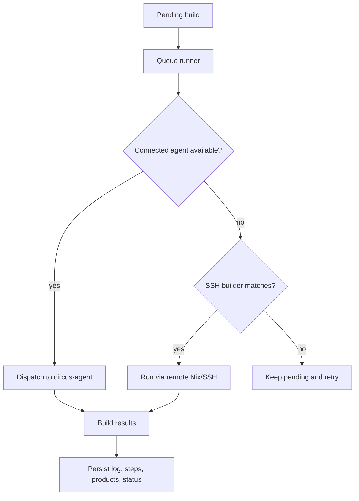
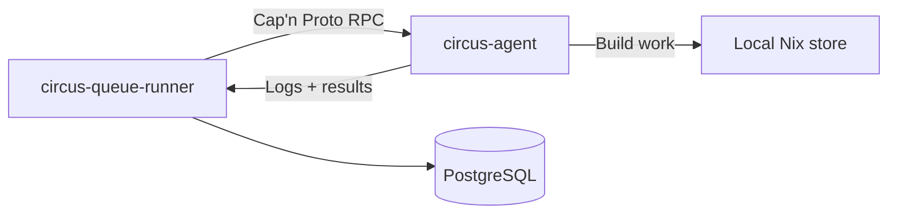

# Design

Circus is still pre-1.0, so this document describes the current shape of the
system rather than an aspirational future version. The goal is to explain how
the pieces fit together, what each daemon is responsible for, and where the
shared database sits in the picture. Until Circus reaches 1.0, this document may
be outdated at any given time but we'll try to keep it up to date as much as
humanly possible. Though, it's a rather difficult as you might appreciate so
your help through issues are appreciated :)

## Overview

Circus is a Nix-focused CI system built around a small set of long-running
services and a PostgreSQL database that acts as the source of truth.

The current deployment model is:

- **`circus-server`** for the API, dashboard, binary cache, metrics, webhooks,
  and authentication
- **`circus-evaluator`** for polling repositories and turning changes into
  evaluation records
- **`circus-queue-runner`** for selecting builds, dispatching work, and managing
  build execution
- **`circus-agent`** for optional persistent build hosts that receive work over
  a long-lived RPC connection
- **PostgreSQL** for all durable state

Most user-facing behavior flows through the server, but the build pipeline is
split on purpose. Evaluations and builds are distinct steps, and Circus keeps
that separation visible in the UI and in the database.

## The Main Pieces

### `circus-server`

The server is the public face of Circus. It serves the dashboard, exposes the
REST API, handles log and build browsing, publishes metrics, and answers cache
and webhook requests.

It also manages:

- API keys and user sessions
- dashboard login flows
- project, jobset, channel, build, and evaluation pages
- the binary cache endpoints
- authentication-backed admin operations

### `circus-evaluator`

The evaluator watches projects for changes and records new evaluations in the
database. It is the component that turns a repository update into something the
rest of Circus can act on.

In practice it:

- polls configured repositories
- reacts to database notifications when work changes
- evaluates Nix expressions
- records evaluation results and derived build data

### `circus-queue-runner`

The queue runner owns build execution. It pulls pending builds from the
database, chooses where they should run, and keeps the build lifecycle moving.

It currently supports two dispatch paths:

- **Legacy SSH builders**, where the runner shells out to remote Nix builds
- **Persistent agents**, where connected `circus-agent` processes receive work
  over Cap'n Proto RPC

The agent path is preferred when available. SSH builders remain as a fallback
and for mixed clusters.

### `circus-agent`

The agent is a long-running helper that sits on a build host. It connects back
to the queue runner, advertises the host's capabilities, receives assignments,
streams logs, and reports results.

This is the distributed-build path for clusters that want the runner to push
work to hosts without relying on per-build SSH setup.

### `circus-common`

`circus-common` holds the shared pieces used by the daemons:

- configuration loading
- database access helpers
- shared data models
- validation and bootstrap logic
- notification, logging, and maintenance helpers

### `circus-proto`

`circus-proto` holds the Cap'n Proto schema and generated Rust bindings for the
runner-to-agent RPC protocol. The schema defines the interfaces that agents and
the queue runner use to communicate: registration, build assignment, log
streaming, result reporting, and presigned upload negotiation. The proto crate
is versioned independently so the runner and agent can detect protocol mismatches
at connection time.

### `circus-migrate-cli` and `circus-migrations`

These crates manage database schema changes. `circus-migrate-cli` is the CLI
entry point (typically invoked as `circus-migrate`), and `circus-migrations`
contains the SQL migration files and runtime support.

### `xtask`

`xtask` is a developer tooling crate. It currently provides a route drift check
that parses route registrations from the source tree without compiling the full
server crate.

## Data Flow

The build pipeline is deliberately split into stages so each step can be
observed independently.

The important part is that the database is not just a passive store. It is the
handoff point between the services. The evaluator records what should happen,
the queue runner decides what actually runs, and the server reads the result
back out for users.

### What gets stored where

- **PostgreSQL** stores projects, jobsets, evaluations, builds, users, API keys,
  notifications, and service state
- **The filesystem** stores logs, cache material, build working data, and other
  runtime artifacts
- **The Nix store** stores actual build outputs

## Build Execution

The queue runner is responsible for choosing the execution path for a build.
That choice depends on the configured systems, available builders, current load,
and whether persistent agents are connected.

The persistent agent path is used when the queue runner has an active connection
to a suitable host. When no agent is available, the runner can still use
configured SSH builders, which keeps existing clusters working while newer
agent-based deployments come online.

## Distributed Builds

Circus supports distributed builds in a way that stays practical for real
clusters.

The agent connection is long-lived. That gives the queue runner a live view of
which machines are available, what they can build, and how loaded they are. The
runner can then prefer a connected agent over an SSH builder when both would be
valid.

If the connection drops, the runner treats that agent as unavailable and retries
the build elsewhere on the next pass. That keeps the system resilient without
requiring manual cleanup for normal disconnects.

## RPC Protocol

The runner and agent communicate over Cap'n Proto RPC. The protocol is defined in
`crates/proto/schema/circus.capnp` and the generated bindings live in
`circus-proto`.

The connection lifecycle works like this:

1. The agent connects to the runner's RPC endpoint (`circus://` or
   `circus+tls://`)
2. The agent calls `Runner.register` with its machine info: name, systems,
   features, speed factor, CPU count
3. The runner validates the protocol version and stores the agent's capabilities
4. The runner calls `Builder.assign` on the agent when a matching build is
   available
5. The agent runs the build, streams logs via `LogSink`, and reports results via
   `ResultSink`
6. The agent sends periodic heartbeats with load averages, memory usage, and PSI
   (Pressure Stall Information) data

For presigned S3 uploads, the agent calls `Runner.requestPresignedUrls` before
starting the build, then uploads directly to S3 and calls
`Runner.notifyUploadComplete` when done.

The runner can also ask an agent to shut down gracefully by calling
`Builder.shutdown`, or abort a build by calling `Builder.abort`.

## Notifications

Circus sends notifications through several channels when build events happen.
The notification system supports six types:

- **Generic webhook**: POST a JSON payload to a configured URL
- **GitHub commit status**: update the commit status via the GitHub API
- **Gitea/Forgejo commit status**: update via the Gitea or Forgejo API
- **GitLab commit status**: update via the GitLab API with a private token
- **Slack**: post a formatted message via a Slack incoming webhook
- **Email**: send an email via SMTP (using lettre with optional TLS)

Notifications fire on build creation (pending), build start (running), and build
completion (success or failure). All notification types support a retry queue
with exponential backoff, configurable max attempts, and a retention period for
completed tasks.

The webhook ingestion side supports inbound push events from GitHub, Gitea,
Forgejo, and GitLab. These trigger evaluations on the matching jobset when the
pushed branch matches.

## Authentication and Security

Circus supports three authentication methods:

- **API keys**: Bearer tokens stored as SHA-256 hashes. Used for API access and
  dashboard login. Keys carry a role (admin, read-only, or custom granular
  permissions).
- **User accounts**: Username/password with session cookies. Used for dashboard
  access. Passwords are hashed with argon2.
- **OAuth (GitHub)**: experimental OAuth2 flow with CSRF protection. Users
  auto-upsert with a read-only role on first login.
- **LDAP**: bind-based authentication with DN template substitution. Also
  auto-upserts local users.

The server enforces several security measures:

- CSRF protection with per-process secrets
- Rate limiting per IP (token bucket, configurable RPS and burst)
- Security headers (X-Content-Type-Options, X-Frame-Options, Referrer-Policy)
- Request body size limits
- CORS (configurable origins, or permissive mode for development)
- LDAP DN injection prevention (metacharacter escaping)
- Audit logging for all mutations

## Binary Cache and Channels

Circus serves a Nix-compatible binary cache at `/nix-cache/`. It supports the
full narinfo protocol: clients request `.narinfo` files by hash, and the server
responds with a signed redirect to the NAR download URL or serves the NAR
directly.

NAR compression is configurable (zstd, bzip2, brotli, xz, or none). The server
can optionally sign narinfo files with a Nix secret key.

Build outputs can also be uploaded to an external cache store (typically S3)
after a successful build. The agent supports direct presigned S3 upload, and the
queue-runner can fall back to `nix copy` for SSH builders.

Channels provide promoted evaluation outputs for consumers. Each channel tracks a
git revision, a binary cache URL, and a store path listing. The server exposes
Hydra-compatible channel endpoints: `git-revision`, `binary-cache-url`,
`store-paths.xz`, and `nixexprs.tar.xz`.

## Configuration

Circus is configured from a TOML file with environment variable overrides. The
same configuration tree is used across the daemons, but each daemon only reads
the sections it needs.

The current high-level groups are:

- `database`
- `server`
- `evaluator`
- `queue_runner`
- `gc`
- `logs`
- `notifications`
- `cache`
- `signing`
- `cache_upload`
- `tracing`
- `oauth`
- `declarative`
- `nix`

Declarative startup data is also supported. On server startup, Circus can
bootstrap projects, jobsets, users, API keys, and remote builders from config.

## User-Facing Shape

From a user's point of view, Circus is organized around a few stable concepts:

- **Projects** group related repositories
- **Jobsets** describe what to evaluate and build
- **Evaluations** record a particular repository state
- **Builds** are the execution results users inspect
- **Channels** provide promoted outputs for consumers
- **Users and API keys** control access

This is why the dashboard mirrors those concepts directly. The service layout
exists to support that workflow, not to expose the internal daemon boundaries as
primary UI concepts.

## What Is Stable Today

The following parts of the design are already real in the current codebase:

- the three main daemons (server, evaluator, queue-runner) and the shared
  PostgreSQL database model
- the optional persistent agent path with Cap'n Proto RPC
- the SSH fallback for clusters without agents
- the dashboard, REST API, binary cache, Prometheus metrics, and webhooks
- declarative bootstrap on startup (projects, jobsets, users, API keys, remote
  builders)
- authentication with API keys, user sessions, and session cookies
- OAuth (GitHub) and LDAP as experimental login methods
- the documented configuration tree with environment variable overrides
- hot-reload of select configuration fields via SIGHUP
- six notification channels (webhook, GitHub, Gitea, GitLab, Slack, email) with
  retry and backoff
- inbound webhook ingestion from GitHub, Gitea, Forgejo, and GitLab
- binary cache protocol with narinfo signing and configurable compression
- channel manifests and Hydra-compatible nixexprs tarball generation
- S3 cache upload with presigned agent-side upload and nix copy fallback
- PSI-aware scheduling for build hosts
- GC root management with configurable retention
- build badges, search, starred jobs, and news/announcements
- OpenAPI specification
- NixOS modules for the daemons and the agent
- integration test suite covering API, auth, webhooks, declarative config,
  distributed builds, and end-to-end workflows

Areas that are still evolving are expected to change over time, especially the
distributed-build surface and the more advanced administrative workflows. The
agent protocol is versioned but may see breaking changes before 1.0.
