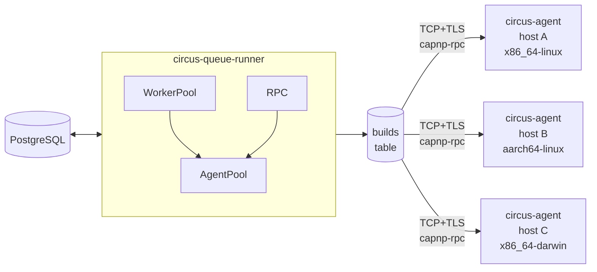

# Distributed Builds in Circus

[manic.systems]: https://github.com/manic.systems

Circus can run builds across a cluster of machines as per our needs in
[manic.systems]. The data plane is a fleet of long-running **agents**, each
running on a build host. Agents connect outbound to the queue-runner over a TCP
socket and stay connected; the runner pushes work down the connection, the agent
streams logs and results back up. This document, in turn, covers the protocol,
the lifecycle, the failure model and how the new agent path coexists with the
legacy SSH dispatch path.

## Why not Hydra's (gRPC) Design?

The new Rust rewrite of Hydra implements this layer with gRPC + tonic +
protobuf. That choice is reasonable, and the schema is the obvious starting
point for any modern fork. Circus picks a different transport: **Cap'n Proto**
with `capnp-rpc`. The reasons are concrete, not aesthetic:

1. **Object-capability RPC.** When an agent connects, it hands the runner a
   `Builder` capability. The runner holds that capability as a typed,
   per-connection handle. There is no `machine_id` lookup in a hash map on every
   method call: the capability _is_ the agent. Capabilities expire when the
   connection drops, so stale agent IDs cannot be addressed.
2. **Promise pipelining.** `assign(...)` returns a promise. The runner can
   immediately use that promise to send `log.write(chunk)` or `result.report`
   without an extra round trip, because the parameters of the next call ride
   along with the first. With gRPC over HTTP/2 this is one ack per call.
3. **No HTTP/2 overhead.** Cap'n Proto runs over plain framed TCP (or a
   tokio-rustls TLS stream). For an internal cluster protocol, HTTP/2's
   stream-prioritisation and headers are not load-bearing, and they cost
   throughput.
4. **Smaller dependency graph.** `capnp`, `capnp-rpc`, `capnp-futures` together
   are leaner than `tonic` + `prost` + `tonic-prost` + `hyper` + `h2` + `tower`.
   Less to keep up to date, less to audit.

Admittedly this comes with a few tradeoff. Namely, the schema is custom and
there is no built-in reflection or "describe service" tooling. We do, however,
compensate with a stable schema, semver, and `protoVersion` strings exchanged at
register time. TLS is also not built-in, but we can easily layer `tokio-rustls`
underneath the framed transport. mTLS works the same way: rustls verifies both
sides before any Cap'n Proto bytes flow.

## Topology



One queue-runner, N agents. The queue-runner owns:

- the build queue (PostgreSQL `builds` table)
- the in-memory `AgentPool` (live capabilities, one per connected agent)
- scheduling: choosing which agent gets which build

The agent owns:

- the local Nix store on its host
- one `nix-store --realise` (or equivalent) child process per concurrent build
- log capture and result reporting

There is no agent-to-agent traffic. Nor do the agents talk to PostgreSQL
directly.

## Protocol

The schema is in `crates/proto/schema/circus.capnp`. The interfaces are:

```capnp
interface Runner {
  register @0 (info :AgentInfo, builder :Builder) -> (session :AgentSession);
  version @1 () -> (proto :Text, server :Text);
}

interface Builder {
  assign @0 (job :BuildAssignment, log :LogSink, result :ResultSink) -> ();
  abort @1 (buildId :Text) -> ();
  shutdown @2 (reason :Text) -> ();
}

interface AgentSession {
  heartbeat @0 (ping :Heartbeat) -> ();
}

interface LogSink {
  write @0 (chunk :Data) -> ();
  close @1 () -> ();
}

interface ResultSink {
  report @0 (result :BuildResult) -> ();
}
```

The flow is as follows

1. Agent dials TCP (optionally wraps in TLS), starts a capnp-rpc system with no
   bootstrap. Calls `runner.register(info, builder)` and keeps the returned
   `session` capability for heartbeats.
2. Runner records the agent in `AgentPool`, retains the `Builder` capability,
   marks the row in `builder_sessions` as live.
3. WorkerPool dequeues a build. The scheduler picks an agent based on `systems`,
   `mandatoryFeatures`, current load, speed factor and PSI thresholds. It calls
   `builder.assign(job, log, result)`. Promise pipelining means the runner can
   immediately enqueue follow-up calls against `log` and `result` if needed; in
   practice it just awaits them.
4. Agent writes log lines via `log.write(chunk)` and ends with `log.close()`. On
   completion it calls `result.report(BuildResult)`. Both sinks are server-side
   capabilities the runner created and passed down; on the runner side `write`
   appends to the live log file, `report` writes the result to PostgreSQL and
   re-queues `BuildStepUpdate` for the notification system.
5. The agent calls `session.heartbeat(ping)` every N seconds with load averages,
   memory, store/build-dir free, current job count, and PSI (`cpuAvg10`,
   `memAvg10`, `ioAvg10`). The runner uses these to gate subsequent dispatch
   decisions.
6. When the connection drops, capnp-rpc drops the `Builder` capability.
   `AgentPool` notices on the next dispatch attempt and falls back to the next
   candidate. Any builds the disconnected agent had in flight are marked stuck
   and reset to `pending` by the orphan sweeper (already implemented at
   `crates/queue-runner/src/runner_loop.rs`).
7. `register` carries a bearer token. The runner SHA-256 hashes it and compares
   constant-time against `[queue_runner.rpc].auth_tokens` (hex digests). mTLS is
   optional; when the server config sets `tls.client_ca` and
   `tls.pin_cn = true`, the client certificate's Common Name must also equal the
   agent's registered `name`.

## Scheduling

The scheduler runs inside the queue-runner's worker pool. For a pending build
with a target `system`:

1. Query candidate agents from `AgentPool::candidates_for(system)`:
   `system in agent.systems` and `current_jobs < max_jobs`. Build-side
   required-features matching is not yet wired (the `Build` model does not carry
   the field; the SSH path's `mandatory_features` gating is the analogue that
   will be reused once it lands).
2. Apply PSI gating. If `psi_threshold` is set, drop candidates whose most
   recent heartbeat has any of `cpuAvg10 / memAvg10 / ioAvg10` above the
   threshold. Heartbeats older than `heartbeat_ttl_secs` are treated as
   "unknown" (advisory only, never penalise).
3. Apply the configured strategy. `SpeedFactorOnly` orders by
   `speedFactor DESC`. `CpuCoreCountWithSpeedFactor` orders by
   `cpuCount * speedFactor DESC`. `Dynamic` orders by
   `(max_jobs - current_jobs) * speedFactor DESC`, so an idle agent wins over a
   partially-loaded faster one.
4. Try candidates in order, sending a `DispatchCommand` through the per-agent
   mpsc. On `Disconnected`, fall through to the next candidate.
5. If no agent matches, fall back to SSH dispatch (legacy path) when a
   `remote_builders` row matches by system; failing that, leave the build
   pending and try again on the next tick.

PSI is local to the queue-runner: the agent reports raw numbers in each
heartbeat, the runner caches the most recent snapshot per agent and the
scheduler reads from that cache. No SSH probing in the agent path.

## Coexistence with SSH dispatch

The existing `run_nix_build_remote` path (SSH + `nix build --store ssh://...`)
stays. The scheduler tries the agent pool first; only when no agent advertises
the required `system` does it look at the legacy `remote_builders` table. This
lets clusters mix:

- Hosts that run `circus-agent` and get push-based dispatch with real-time
  heartbeats and PSI gating.
- Hosts reachable only by SSH, treated as pull-by-the-runner like before.

A `remote_builder` row whose `name` matches a connected agent is upgraded: the
SSH path becomes a cold standby and the agent path is preferred.

## Cluster setup

Single queue-runner, multiple agents:

```toml
# fc.toml on the queue-runner host
[queue_runner]
poll_interval = 5
work_dir      = "/var/lib/circus/queue-runner"
psi_threshold = 80.0 # 0..100, advisory; null disables

[queue_runner.rpc]
bind               = "0.0.0.0:8443"
# SHA-256 hex digests of accepted bearer tokens.
auth_tokens        = [ "abcdef0123...sha256-of-the-raw-token" ]
max_connections    = 256
heartbeat_ttl_secs = 60

[queue_runner.rpc.tls]                           # optional; omit for plain TCP
cert_file = "/var/lib/circus/tls/runner.crt"
key_file  = "/var/lib/circus/tls/runner.key"
client_ca = "/var/lib/circus/tls/clients.ca.crt" # presence => mTLS required
pin_cn    = true                                 # CN must equal agent.name
```

```toml
# circus-agent.toml on each builder host
[agent]
name                    = "build-01"
runner_url              = "circus+tls://runner.internal:8443"
auth_token              = "the-raw-token-the-runner-hashed"
systems                 = [ "x86_64-linux", "i686-linux" ]
supported_features      = [ "kvm", "nixos-test" ]
mandatory_features      = []
max_jobs                = 8
speed_factor            = 4.0
heartbeat_interval_secs = 10
reconnect_delay_secs    = 5
work_dir                = "/var/lib/circus-agent"

# required for circus+tls://
[agent.tls]
ca_file   = "/etc/circus/tls/runner.ca.crt"
cert_file = "/etc/circus/tls/build-01.crt"
key_file  = "/etc/circus/tls/build-01.key"
```

The agent runs as a Systemd service. A NixOS module is provided at
`nix/modules/circus-agent.nix` and exposed as `self.nixosModules.circus-agent`.
The queue-runner picks the agent up the first time it connects; no operator
action is required beyond provisioning the token and (optionally) TLS material.

If you have a setup already, existing clusters keep working. To migrate a host:

1. Install `circus-agent` on the build host.
2. Issue an auth token, configure `circus-agent.toml`, start the service.
3. Confirm the host appears connected on the admin API:
   `GET /api/v1/admin/builders/sessions/connected` (live) or
   `GET /api/v1/admin/builders/sessions/{machine_id}` (single row).
4. Leave the `remote_builders` row in place. Once the agent is healthy you can
   drop the row, or keep it as a cold standby for the SSH path.

There is no flag day. The runner prefers connected agents over SSH on a
per-dispatch basis; flipping a host between the two transports is purely a
matter of which service is running.

### Security

- Bearer token authentication on `register`. Tokens are issued by the operator
  out of band. The runner stores SHA-256 hex digests in
  `[queue_runner.rpc].auth_tokens`; the agent sends the raw token and the runner
  hashes + compares in constant time. The `builder_sessions` table has an
  `auth_token_hash` column reserved for per-agent tokens but no code path
  consults it yet.
- Optional mTLS via `tokio-rustls`. Cert + key live under
  `[queue_runner.rpc].tls`; setting `client_ca` switches the acceptor to
  `WebPkiClientVerifier` so client certs are required. With `pin_cn = true` (the
  default when `client_ca` is set), the registering agent's `name` must equal
  the CN extracted from the verified client certificate.
- Cap'n Proto framing is bounded by `capnp::message::ReaderOptions` defaults;
  oversized messages are rejected at decode.
- The runner caps per-build log size at `BuildAssignment.max_log_size` (passed
  down from the worker pool) and aborts the build with
  `BuildOutcome::BuildFailure` plus an explanatory `error_message` when the cap
  is hit.
